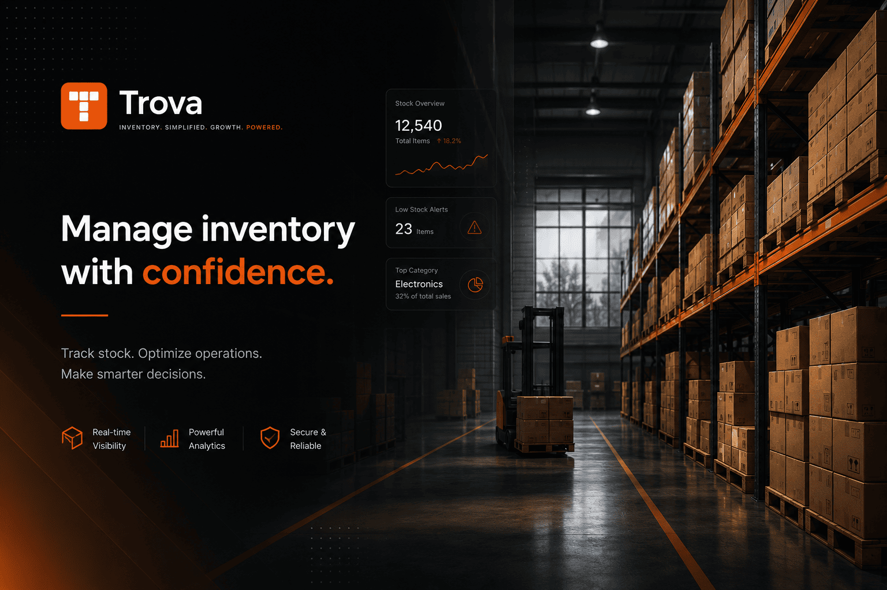
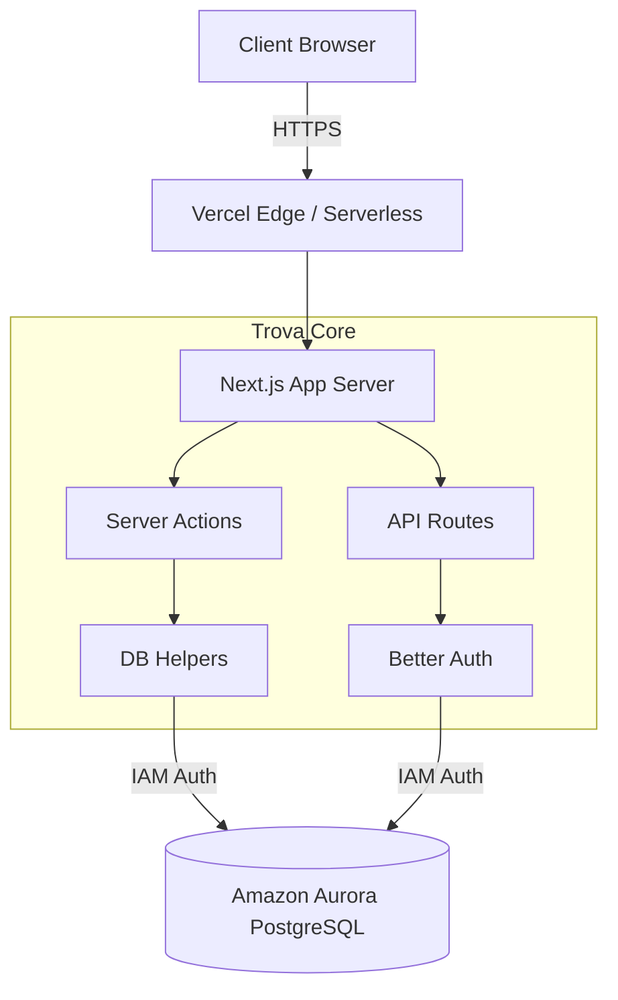

# Trova Inventory Management System



Trova is a full-stack inventory management application built for small-to-medium retail stores. It handles the complete retail lifecycle: supplier intake, product cataloguing, point-of-sale, vendor relationships, expiry/stock alerts, and owner-level analytics. The entire system is multi-tenant by design—each store is isolated, and every user belongs to exactly one store with a defined role. Multi-currency support enables seamless operations across different markets with real-time currency formatting.

---

## Tech Stack

| Layer       | Technology                                          |
|-------------|-----------------------------------------------------|
| Framework   | Next.js 16 (App Router)                             |
| Database    | Amazon Aurora PostgreSQL (IAM auth via RDS Signer)  |
| Auth        | Better Auth (email + password, session-based)       |
| UI          | Tailwind CSS v4 + shadcn/ui                         |
| Fonts       | Inter (UI), JetBrains Mono (SKUs / numbers)         |
| Hosting     | Vercel                                              |

---

## Architecture



---

## Project Structure

The codebase is organized following standard Next.js App Router conventions, cleanly separating routes, components, and server logic.

### `app/` (Routing & Pages)
- **`/(dashboard)`**: Protected routes requiring an active session. Contains all core features like `/dashboard`, `/products`, `/sales`, `/intake`, etc.
- **`/landing`**: Public marketing pages and components.
- **`/api`**: Serverless API endpoints, primarily for authentication (`/api/auth/[...all]`) and database management (`/api/migrate`).
- **Auth Routes**: `/sign-in`, `/sign-up`, and `/join` for user onboarding.

### `components/` (UI Components)
- **`/layout`**: App shell elements (sidebar, mobile nav, topbar).
- **`/ui`**: Shared, reusable UI primitives (buttons, inputs, dialogs) built with Tailwind and shadcn/ui.
- **Feature Modules**: Grouped by domain (`/sales`, `/products`, `/intake`, `/analytics`, `/settings`) for better encapsulation.

### `lib/` (Core Logic & Utilities)
- **`/db`**: Database schema definitions (`schema.ts`), connection pool with automatic IAM token rotation (`index.ts`), and typed query helpers.
- **`/auth`**: Better Auth configuration (`auth.ts`) and Role-Based Access Control (RBAC) utilities (`role-access.ts`).
- **`/actions`**: Next.js Server Actions handling secure backend data mutations.
- **Utilities**: Currency formatting, context providers, and general helper functions.

---

## Multi-Currency Support

Trova supports multi-currency operations, allowing stores to operate seamlessly across different markets:

- **Store Currency Configuration**: Each store selects its trading currency during setup (NGN, USD, GBP, etc.)
- **Currency Context**: The `CurrencyProvider` makes the store's currency available throughout the app via React Context
- **Dynamic Formatting**: All monetary values are formatted with locale-specific symbols and decimal rules using `formatCurrency()` utility
- **Consistent Display**: Product prices, sale totals, analytics, and batch costs all respect the store's configured currency
- **Batch Price Tracking**: Each stock batch records its cost in the store's currency at the time of intake
- **Analytics by Currency**: Revenue calculations, margins, and trends all operate in the store's currency

Currency codes and symbols are centrally managed in `lib/currency.ts` for easy maintenance and consistency.

---

The application uses 8 domain tables plus 4 Better Auth system tables:

```
stores        one row per store (name, currency, low_stock_threshold)
users         app users linked to a store (role: owner | staff)
categories    product groupings scoped per store
vendors       supplier records (type: direct | consignment)
products      SKUs with cost, price, stock_qty, reorder_level
batches       stock intake records (product, vendor, expiry, reference_number)
sales         transaction headers (receipt_number, total, payment_method)
sale_items    line items per sale (product, qty, unit_price, batch_ref)

"user"        Better Auth identity (email, hashed password)
session       active user sessions
account       credential storage (OAuth-compatible)
verification  email verification tokens
```

Key fields by feature:

| Feature                | Table          | Key Fields                               |
|------------------------|----------------|------------------------------------------|
| Multi-currency         | `stores`       | `currency` (stored code: NGN, USD, GBP)  |
| Batch tracking         | `batches`      | `reference_number`, `received_at`        |
| Sales line items       | `sale_items`   | `product_id`, `qty_sold`, `unit_price`   |
| Expiry management      | `batches`      | `expiry_date` (nullable, for tracking)    |
| Stock deduction (FEFO) | `batches`      | `qty_remaining` (decremented on sale)     |
| Consignment handling   | `batches`      | `is_consignment` (boolean)                |

---

## Environment Variables

| Variable             | Required | Purpose                                                    |
|----------------------|----------|------------------------------------------------------------|
| `BETTER_AUTH_SECRET` | Yes      | Session signing key (`openssl rand -base64 32`)            |
| `MIGRATION_SECRET`   | Yes      | Protects `/api/migrate` and `/api/purge`                   |
| `AWS_REGION`         | Yes      | Aurora region set by Aurora integration                  |
| `AWS_ROLE_ARN`       | Yes      | IAM role ARN set by Aurora integration                   |
| `PGHOST`             | Yes      | Aurora cluster hostname set by Aurora integration        |
| `PGUSER`             | Yes      | Database username set by Aurora integration              |
| `PGDATABASE`         | Yes      | Database name set by Aurora integration                  |
| `PGSSLMODE`          | Yes      | Must be `require` set by Aurora integration              |

---

## Running the Migration

After deploying, apply the schema by visiting:

```
GET https://your-domain.vercel.app/api/migrate?secret=YOUR_MIGRATION_SECRET
```

The endpoint is fully idempotent it uses `CREATE TABLE IF NOT EXISTS` and
`CREATE INDEX IF NOT EXISTS` throughout, so it is safe to re-run at any time.

---

## Recent Improvements

### v1.2.0 Updates
- **Role-Based Access Control (RBAC)**: Expanded roles from just Owner/Staff to Owner, Storekeeper, and Cashier. Navigation is now fully dynamic based on permissions, and strict route guards prevent unauthorized access without throwing server errors.
- **Responsive Sales Page**: The `/sales/new` POS interface is now fully responsive. On mobile, it utilizes a vertical stack and a slide-up checkout drawer, optimizing screen space for small devices.

### v1.1.0 Updates
- **Always-Expanded Sidebar on Desktop**: Desktop users now see the full sidebar by default with labels visible, improving navigation clarity. Mobile users can still collapse it.
- **Batch Reference Tracking**: All stock intake records now display a batch reference number for easier tracking and audit trails.
- **Sales Item Count**: Sales history now shows the number of items in each transaction for quick overview.
- **Mobile-Optimized Forms**: Fixed scrolling issues in add product and add vendor slide panels on mobile devices.
- **Fixed Chart Rendering**: Dashboard weekly chart now properly displays with correct sizing and data.

---

## Key Features

| Feature                    | Description                                         |
|----------------------------|-----------------------------------------------------|
| **Multi-Tenant Isolation** | Each store operates independently with no data leakage |
| **Role-Based Access**      | Owner / Staff roles with granular permission control |
| **Multi-Currency Support** | Track inventory and sales in any supported currency |
| **FEFO Inventory**         | First-Expiry-First-Out batch deduction on sales    |
| **Consignment Tracking**   | Separate handling for consignment vs. purchased stock |
| **Real-Time Alerts**       | Low stock and expiry warnings on dashboard          |
| **PDF Receipts**           | Generated sales receipts with full transaction details |
| **Analytics Dashboard**    | Revenue trends, top products, margin analysis      |
| **Team Collaboration**     | Invite staff with secure token-based onboarding    |
| **CSV Export**             | Vendor and product data export for external analysis |

---

```bash
pnpm install
pnpm dev
```

The dev server starts on `http://localhost:3000`. You will need either the Aurora
integration credentials or a local PostgreSQL instance configured in `.env.local`.
Run the migration before first use:

```
GET http://localhost:3000/api/migrate?secret=YOUR_MIGRATION_SECRET
```

---

## User Flow

### 1. Owner Sign-Up (First Run)

1. Visit `https://trova-ims.vercel.app` and click **Get started**, or navigate directly to `/sign-up`
2. Enter full name, email, and a password (minimum 8 characters)
3. On the very first sign-up, Trova automatically:
   - Creates a new store named after the owner
   - Creates the owner user record linked to that store
   - Assigns the `owner` role
4. Redirects to `/dashboard`

---

### 2. Owner Onboarding (Recommended Order)

Once inside the dashboard, complete setup in this sequence:

**a. Store Settings** → `/settings`
- Set the official store name, trading currency, and low-stock threshold
- Optionally add store address and contact details

**b. Add Vendors** → `/vendors`
- Create at least one vendor before logging any intake
- Set vendor type: `direct` (store purchases outright) or `consignment` (vendor retains ownership until sold)

**c. Create Categories** → `/products` (via the category selector)
- Categories organise the product catalogue
- Examples: Beverages, Snacks, Stationery, Pharmaceuticals

**d. Add Products** → `/products`
- Create products with: name, SKU, category, unit of measure, selling price, cost price, and reorder level
- Stock quantity starts at `0` it is populated entirely via Intake

---

### 3. Logging Stock Intake → `/intake`

1. Click **New Intake**
2. Select the product and the delivering vendor
3. Enter quantity received, unit cost, and expiry date (optional but recommended)
4. Submit the product's `stock_qty` increments by the entered quantity
5. A batch record is created for full traceability (vendor, cost, date, expiry)

Intake history is listed on `/intake` with the ability to drill into any batch record.

---

### 4. Processing a Sale → `/sales/new`

1. Click **New Sale**
2. Search for products and add them with quantities
3. The system shows real-time stock availability and auto-calculates the total
4. Select the payment method: cash, card, or bank transfer
5. Submit inventory is decremented immediately across all affected products
6. A receipt is generated; it can be downloaded as a PDF from the sale detail page

---

### 5. Monitoring Alerts → `/alerts`

Trova surfaces two alert categories proactively:

- **Low Stock** products at or below their configured reorder level
- **Expiring Soon** batches with an expiry date within the alert window (default 7 days)

The alert count appears on the dashboard home page for all users. Owners and staff can navigate to `/alerts` to view every affected item and act on it directly (reorder, pull stock, etc.).

---

### 6. Team Management (Owner only) → `/settings`

1. Navigate to Settings and open the Team tab
2. Enter the email address of a new team member and click **Send Invite**
3. The invitee receives a unique join link at `/join?token=...`
4. They create their account through the join page and are automatically linked to the owner's store with the `staff` role
5. Staff can process sales, log intake, and manage products but cannot view owner analytics or change store settings

To remove a team member, the owner can revoke their access from the team management table.

---

### 7. Analytics (Owner only) → `/analytics`

- Filter by any custom date range
- View total revenue, number of transactions, and average order value for the period
- See a ranked list of top-selling products by units and revenue
- Review the daily revenue chart to identify trends and peak days
- Compare current period against previous for growth tracking

---

## Role Permissions

| Feature                    | Owner | Storekeeper | Cashier |
|----------------------------|:-----:|:-----------:|:-------:|
| View Dashboard             | Yes   | Yes         | Alerts only |
| View Products              | Yes   | Yes         | Yes     |
| Add / Edit Products        | Yes   | Yes         | No      |
| View / Edit Vendors        | Yes   | Yes         | No      |
| Log Stock Intake           | Yes   | Yes         | No      |
| Process Sales (POS)        | Yes   | Yes         | Yes     |
| View Sales History         | All   | All         | Own only|
| View & Action Alerts       | Yes   | Yes         | No      |
| View Full Analytics        | Yes   | No          | No      |
| Manage Store Settings      | Yes   | No          | No      |

---

## Design System

All colours, spacing, and radii are CSS custom properties defined in `app/globals.css`.

| Token                  | Value       | Usage                              |
|------------------------|-------------|------------------------------------|
| `--bg-base`            | `#111111`   | Page background                    |
| `--bg-nav`             | `#0D0D0D`   | Sidebar, topbar, bottom nav        |
| `--bg-card`            | `#1E1E1E`   | Card and panel backgrounds         |
| `--accent-primary`     | `#F5610A`   | Brand orange CTAs, active states |
| `--text-primary`       | `#FFFFFF`   | Primary body text                  |
| `--text-secondary`     | `#A3A3A3`   | Supporting text, labels            |
| `--text-muted`         | `#666666`   | Placeholders, disabled states      |
| `--positive`           | `#4ADE80`   | Success, positive trend            |
| `--danger`             | `#F87171`   | Error, critical state              |
| `--warning`            | `#FBBF24`   | Alert, caution state               |

Typography uses two families only: **Inter** for all UI text and **JetBrains Mono** for
SKUs, receipt numbers, batch references, and any tabular numeric data.

---

## Deployment

Trova is deployed on Vercel. Every push to the head branch triggers a preview deployment.
Merging to `main` triggers a production deployment automatically.

The Amazon Aurora PostgreSQL integration is connected at the Vercel project level and
injects all `PG*` and `AWS_*` environment variables into the runtime automatically.
No manual credential management is required after the initial integration setup.

---

## License

This project is licensed under the terms of the [LICENSE](./LICENSE) file.
